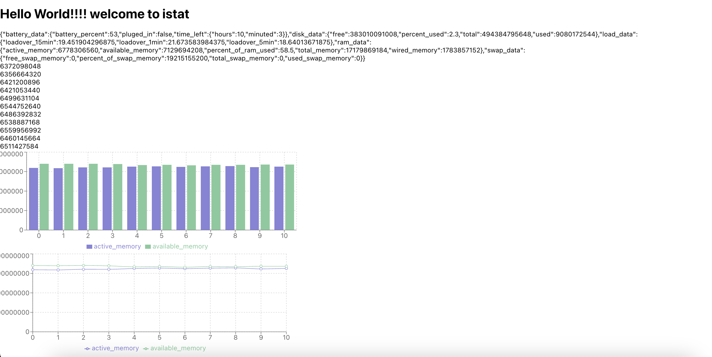

my progress

</img>

#new one

-> battery data {%, timeleft, charging or not}
-> system temperature
-> Ram {%, ramused, ramavailable, swap_memory}
-> storage data {total, used, available}
-> CPU {%used, load_Data}
-> fan {speed}

need to find a way to update data every 1sec

done:
RAM - {virtual, swap}
Battery
Disk storage
cpu load